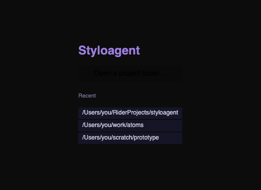
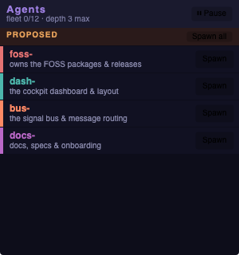
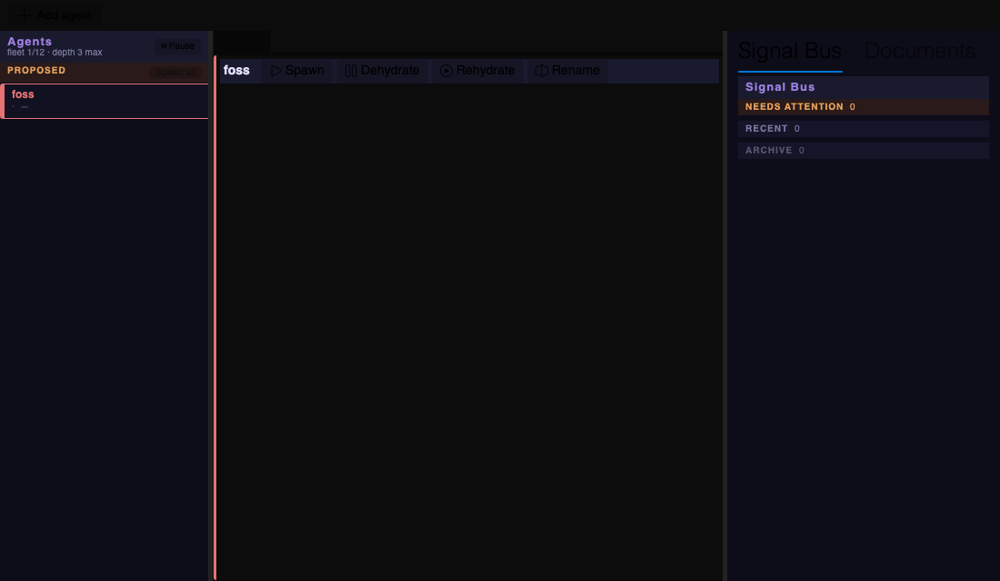
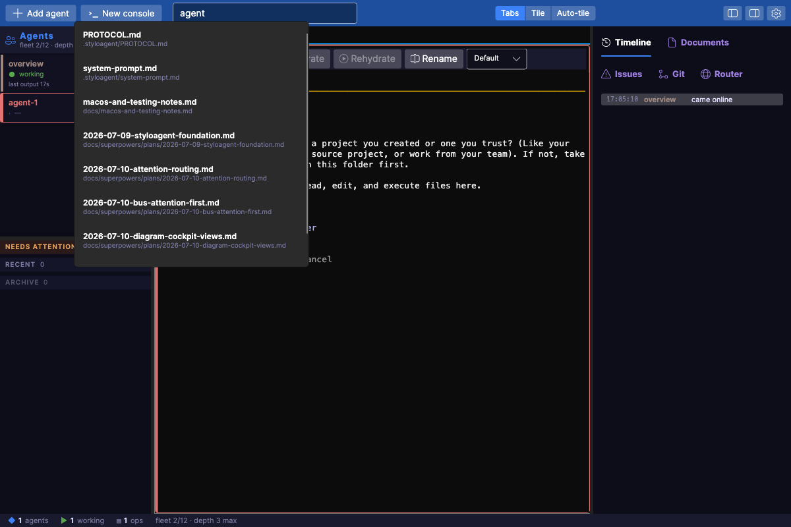
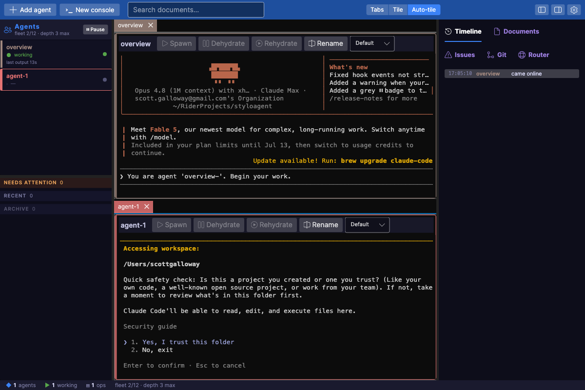
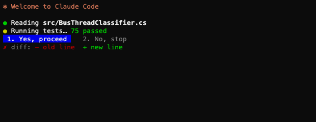
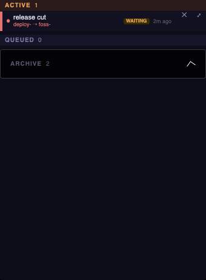
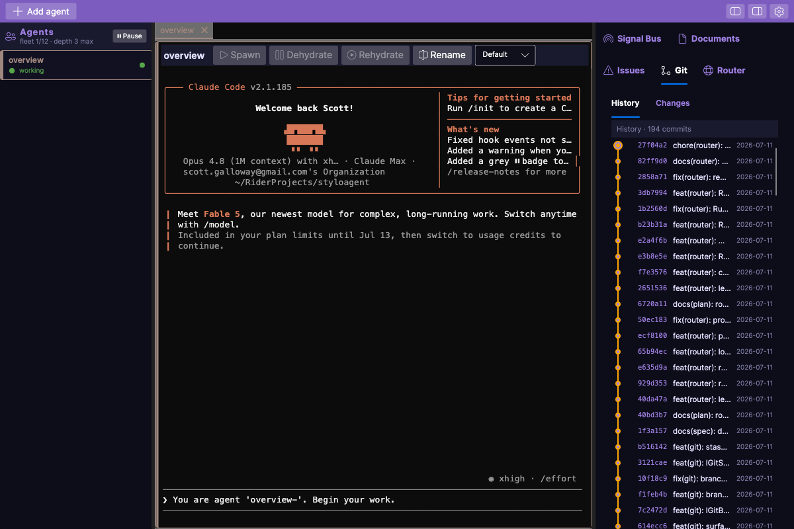
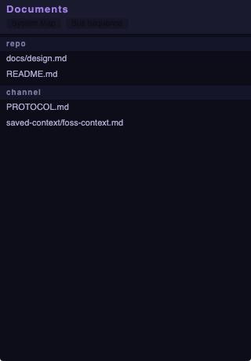
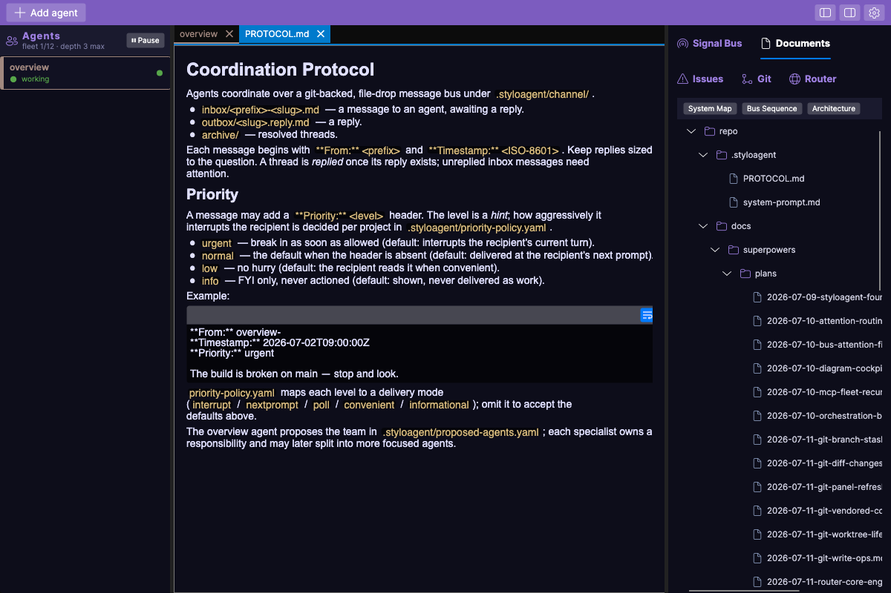

# Styloagent

> CONTRIBUTOR POLICY: NONE ARE ACCEPTED FORK IT, MAKE IT YOUR OWN!

A cross-platform desktop **cockpit** for a fleet of long-lived coding agents that
coordinate through a git-backed, file-drop message bus and a worktree-per-responsibility
model. Built with .NET 10 and Avalonia.

Instead of one giant context trying to understand an entire codebase, work is decomposed
across many focused, long-lived specialist agents — each with its own terminal, its own
worktree, and its own running context document. Styloagent is the environment those agents
run *inside*, and the surface a human uses to see and drive them.

## Getting started

Point Styloagent at a project folder. On first open it scaffolds a `.styloagent/` config
(system prompt, coordination protocol, and the file-drop channel) and remembers the folder in
your recents:



It then launches a single **overview** agent with that system prompt. The overview reads the
repo, decides the initial subsystems, and writes them to `.styloagent/proposed-agents.yaml`.
Styloagent watches that file and surfaces the suggestions as a **PROPOSED** section at the top of
the roster — colour-coded by prefix, each with a one-click **Spawn** (or **Spawn all**):



Clicking **Spawn** promotes a proposal into a live, long-lived agent with its own terminal in the
cockpit. From there the team keeps splitting and specialising through the coordination protocol.

## The cockpit

Agents and their shared **Signal Bus** down the left, dockable agent terminals in the centre, and a
`Timeline | Documents | Issues | Git | Router` panel on the right — with a fleet **instruments
strip** along the bottom (live agents · working · waiting · ops):



### Top bar

Everything front-of-house: **Add agent** and **New console** (a plain shell, not an agent), a
Lucene-backed **document search** with autosuggest (type, click a result to open), a **layout
switch** (Tabs / Tile / Auto-tile), and Settings — accent themes, light/dark, and terminal &
markdown font sizes, all persisted:



### Layout modes

Tab the panes, tile them evenly, or **auto-tile** — the starter agent full-width on top with the
rest gridded below. The active tab wears its agent's identity colour:



### Activity Timeline

A newest-first operations feed of what the fleet is doing — each agent's tool operations *with the
file it touched* (e.g. "editing · Foo.cs"), lifecycle and attention, and the messages they send over
the bus. Click a file op to open it in a syntax-highlighted read-only source view.

### Real terminals, in colour

Each pane launches a real `claude` (or any CLI) over a PTY and renders its full-colour TUI —
24-bit truecolor, the 256-colour palette, background highlights, bold and inverse:



### Signal Bus — attention-first

Agents coordinate through the `send_message` MCP tool, which writes a durable markdown trace to the
channel *and* delivers in-process. The bus — in the left column under the roster — groups it so
*what needs you* is glanceable: a pinned **Needs attention** group (unreplied threads), then
**Recent**, then **Archive** — each row with a status glyph (● unreplied · ↩ replied · ▤ archived),
colour-coded participants matching the roster, and relative time:



### Git — history at a glance

The embedded git client (vendored from [SourceGit](https://github.com/sourcegit-scm/sourcegit)'s
MIT controls) shows the selected agent's worktree — or the shared project repo — as a commit
graph with subject, short SHA and date per row, plus a Changes tab for staging and committing:



### Document Library

A file/folder tree of the project's docs (and channel messages); click a file to open it as a
rendered document in the centre dock (tile it beside a terminal):



Documents render with lucidVIEW's presentation — headings, code, lists, and real
[Naiad](https://www.nuget.org/packages/Naiad) diagrams — via the extracted
`Mostlylucid.LucidView.Markdown` control:



> Every screenshot in this README is generated **headlessly from the real controls** by the UITest suite
> (`tests/Styloagent.UITests/ReadmeScreenshotTests.cs`) using the
> [`Mostlylucid.Avalonia.UITesting`](https://www.nuget.org/packages/Mostlylucid.Avalonia.UITesting)
> framework — so the README always reflects the actual UI. Run `dotnet test` to refresh them.

## Status

The cockpit shell and its panels are built and tested end-to-end:

- **Terminals** — real PTY sessions over [Porta.Pty](https://github.com/tomlm/Porta.Pty)
  rendered with the XTerm.NET VT engine, full per-cell colour (fg/bg/inverse/bold), typeable,
  hosted as floatable/tabbable Dock documents.
- **Agent roster** — colour-coded, with a live **⚠ needs-you** state badge driven by injected
  Claude Code hooks (§4.4 hook-state channel).
- **Signal Bus** — attention-first threads from the `ChannelProjection`, colour-aligned with the
  roster.
- **Document Library** — repo+channel markdown, opened as rendered documents via
  `Mostlylucid.LucidView.Markdown` (LiveMarkdown.Avalonia + Naiad), extracted from lucidVIEW.
- **Onboarding** — point at a folder → scaffold `.styloagent/` → launch the **overview** agent
  (system prompt injected) → watch `proposed-agents.yaml` → a **PROPOSED** roster section you spawn
  from. Recents remembered; `STYLOAGENT_REPO` opens a project directly.
- **`Styloagent.Core`** — fleet manifest, YAML persistence (VYaml), channel→manifest seeding, the
  `AgentSession` spawn → dehydrate → rehydrate state machine, and the pure bus/doc/hook logic.

The design and implementation plans live under [`docs/superpowers/`](docs/superpowers/).

## Tech stack

.NET 10 · Avalonia 11.3 · [Dock](https://github.com/wieslawsoltes/Dock) · Porta.Pty ·
XTerm.NET · [VYaml](https://github.com/hadashiA/VYaml) ·
`Mostlylucid.LucidView.Markdown` (LiveMarkdown.Avalonia + Naiad) ·
[`Mostlylucid.Avalonia.UITesting`](https://www.nuget.org/packages/Mostlylucid.Avalonia.UITesting) · xUnit.

## Building

```bash
dotnet build Styloagent.sln
dotnet test
```

## License

TBD.
