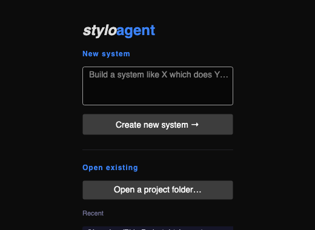
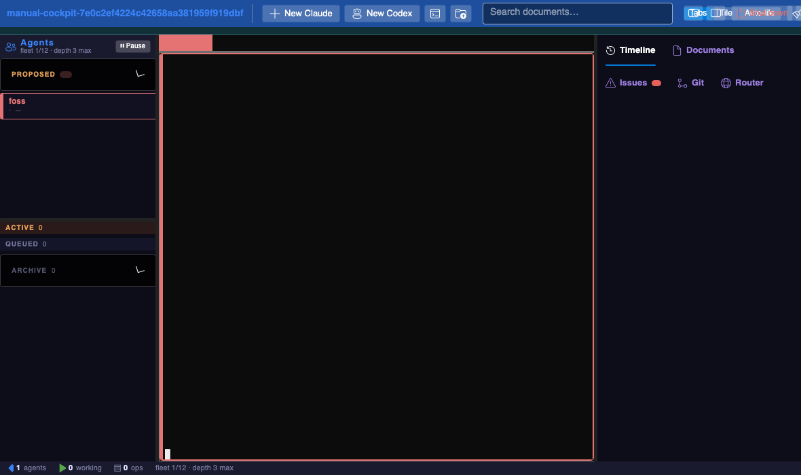
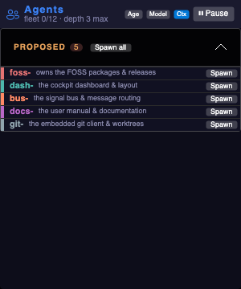
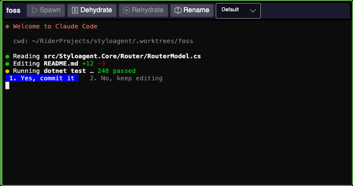
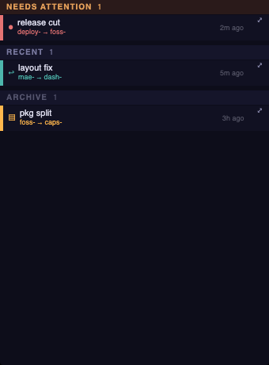
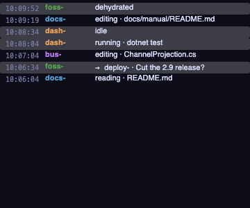
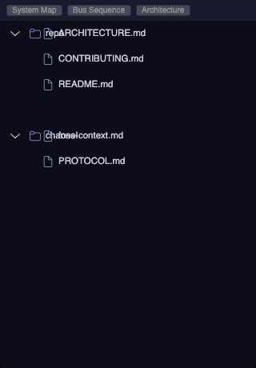
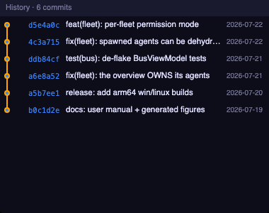
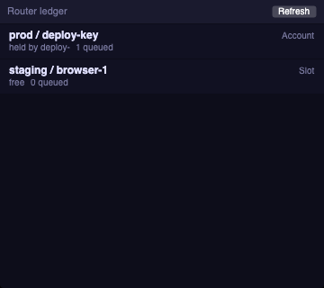
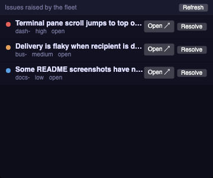

# Styloagent — User Manual

Styloagent is a cross-platform desktop **cockpit** for a fleet of long-lived coding agents.
Instead of one giant context trying to hold an entire codebase, work is decomposed across many
focused, long-lived specialist agents — each with its own terminal, its own git worktree, and its
own running context document. Styloagent is the environment those agents run *inside*, and the
surface you use to see and drive them.

This manual walks through the cockpit panel by panel: how to open a project, spawn and manage
agents, coordinate them over the attention-first Signal Bus, follow their work on the Activity
Timeline, browse the Document Library, and read the Git and Router panels.

> **Every figure in this manual is generated headlessly from the real controls** by the UITest
> suite (`tests/Styloagent.UITests/ManualScreenshotTests.cs`) using the
> [`Mostlylucid.Avalonia.UITesting`](https://www.nuget.org/packages/Mostlylucid.Avalonia.UITesting)
> framework — the same mechanism the [README](../../README.md) uses. Run `dotnet test` to refresh
> them into `docs/manual/images/`. The manual therefore always reflects the actual UI.

---

## Contents

1. [Getting started](#1-getting-started)
2. [The cockpit at a glance](#2-the-cockpit-at-a-glance)
3. [The roster & the PROPOSED section](#3-the-roster--the-proposed-section)
4. [Terminals & the session lifecycle](#4-terminals--the-session-lifecycle)
5. [The Signal Bus — attention-first coordination](#5-the-signal-bus--attention-first-coordination)
6. [The Activity Timeline](#6-the-activity-timeline)
7. [The Document Library & search](#7-the-document-library--search)
8. [The Git panel](#8-the-git-panel)
9. [The Router](#9-the-router)
10. [The Issues panel](#10-the-issues-panel)
11. [Settings & preferences](#11-settings--preferences)
12. [Keyboard & mouse reference](#12-keyboard--mouse-reference)
13. [Known limitations & TODO](#13-known-limitations--todo)

---

## 1. Getting started

Point Styloagent at a project folder. On first open it scaffolds a `.styloagent/` config — a system
prompt, a coordination protocol, and the file-drop **channel** the fleet talks over — and remembers
the folder in your recents so you can reopen it with one click.



From the welcome screen you can:

- **Open a folder** — pick any project directory. Styloagent scaffolds `.styloagent/` if it's not
  there yet and opens the cockpit.
- **Pick a recent** — the list remembers folders you've opened before.

You can also skip the picker entirely by setting the `STYLOAGENT_REPO` environment variable to a
project path; Styloagent opens it directly.

### What happens on open

1. Styloagent launches a single **overview** agent with the scaffolded system prompt.
2. The overview reads the repo, decides the initial subsystems, and writes them to
   `.styloagent/proposed-agents.yaml`.
3. Styloagent watches that file and surfaces the suggestions as a **PROPOSED** section at the top of
   the roster (see [§3](#3-the-roster--the-proposed-section)).
4. You promote proposals into live agents with a click — and from there the team keeps splitting and
   specialising through the coordination protocol.

---

## 2. The cockpit at a glance

The cockpit has three columns and two strips:



| Region | What lives there |
| --- | --- |
| **Top bar** | **Add agent**, **New console** (a plain shell, not an agent), a Lucene-backed **document search** with autosuggest, a **layout switch** (Tabs / Tile / Auto-tile), and **Settings**. |
| **Left column** | The **roster** of agents (colour-coded, with live state badges) above the **Signal Bus** (attention-first message threads). |
| **Centre** | Dockable **agent terminals** — real `claude` (or any CLI) sessions over a PTY. Float them, tab them, or tile them. |
| **Right panel** | A tabbed inspector: **Timeline · Documents · Issues · Git · Router**. |
| **Bottom strip** | The fleet **instruments** readout: live agents · working · idle · timeline operations. |

The left roster and the right panel can each be collapsed to give the centre terminals more room.

### The instruments strip

Along the bottom, the instruments summarise the fleet at a glance:

- **live agents** — how many agent panes are open.
- **working** — agents currently running a tool (per their hook state).
- **idle** — agents waiting with nothing queued.
- **operations** — the number of entries on the Activity Timeline.

When one or more agents are blocked on you, the roster header shows a **⚠ N waiting** badge and a
**Jump ⌥→** button that reveals the oldest waiting agent.

---

## 3. The roster & the PROPOSED section

The roster is the fleet's org chart. Each agent gets a row, colour-coded by its prefix — the same
hue as its terminal accent and its messages on the bus, so an agent is recognisable everywhere.



### The PROPOSED section

When the overview agent proposes new subsystems it writes them to `.styloagent/proposed-agents.yaml`,
and they appear in a highlighted **PROPOSED** block at the top of the roster:

- Each proposal shows its **prefix** (colour-coded) and a one-line **responsibility**.
- **Spawn** promotes a single proposal into a live, long-lived agent with its own terminal.
- **Spawn all** promotes the whole proposed team at once.

A spawned proposal becomes an agent **owned by the overview** — the authority tree stays
single-rooted, so lineage (who spawned whom) is always clear.

### Live roster rows

Once agents are live, each row shows:

- A **colour stripe** and the agent's **display name** in its identity colour.
- A **state glyph + headline**, driven by the agent's Claude Code hook stream:
  - **● working** (green) — with a live activity detail, e.g. *"editing · RouterModel.cs"*.
  - **○ idle** (grey) — running, nothing in flight.
  - **⚠ needs you** (amber) — blocked on a human; the row is highlighted amber so it's glanceable.
  - **✕ exited** (red) — the session ended.
- A **"last output Ns"** relative readout, and a compact **token / context** readout (e.g.
  *"83k · 22%"*) read from the agent's transcript.
- Spawned children are **indented** under the agent that spawned them.

The roster header carries the **fleet HUD** — `fleet <count>/<max> · depth <max>` — and a **⏸ Pause**
toggle that blocks all governor-checked spawns while it's on (a guardrail for a runaway fleet).

---

## 4. Terminals & the session lifecycle

Each agent pane hosts a **real terminal**: a `claude` (or any CLI) process running over a PTY
([Porta.Pty](https://github.com/tomlm/Porta.Pty)), rendered by the XTerm.NET VT engine with full
per-cell colour — 24-bit truecolor, the 256-colour palette, background highlights, bold and inverse.
Panes are Dock documents: float them out, tab them, or tile them.



### The pane toolbar

Above each terminal is a toolbar with the agent's name and its lifecycle controls:

| Button | What it does |
| --- | --- |
| **Spawn** ▶ | Starts the agent's session, launching `claude` with the agent's launch prompt. |
| **Dehydrate** ⏸ | Suspends (parks) the agent, freeing its PTY, after checkpointing its context. |
| **Rehydrate** ▶ | Revives a dehydrated agent from its saved context, resuming where it left off. |
| **Rename** | Changes the display name (and the dock tab caption). |
| **Theme picker** | Applies a per-terminal colour theme. |

### The lifecycle state machine

An agent moves through **Unspawned → Live → Dehydrated → Live**:

- **Spawn** reads the agent's launch prompt (or a minimal built-in brief) and starts `claude`. The
  button is disabled once the agent is already Live, so you can't orphan a running process.
- **Dehydrate** asks the session to checkpoint and suspend. It's only available when the agent is
  **Live** *and* has a saved-context path to write to. If the checkpoint isn't acknowledged within
  ~30 seconds, the agent stays Live and the button reflects that — no silent loss.
- **Rehydrate** is only available when the agent is **Dehydrated**. It points the revived agent at its
  own checkpoint file so it reloads its saved context and resumes.

Dehydrating is how you keep a large fleet affordable: park the agents you're not actively watching to
free their PTYs, and revive them on demand. You rarely have to do it by hand — **sending a bus message
to a parked agent auto-rehydrates it first**, so the message always lands on a live session.

---

## 5. The Signal Bus — attention-first coordination

Agents coordinate through the `send_message` MCP tool, which writes a durable markdown trace to the
channel *and* delivers the message in-process. The Signal Bus, in the left column under the roster,
groups those messages so that **what needs you is always glanceable**.



Messages are grouped into three sections:

1. **Needs attention** (pinned) — unreplied threads addressed to you or awaiting a decision.
2. **Recent** — threads that have been replied to or are just informational.
3. **Archive** — resolved, archived threads.

Each row carries:

- A **status glyph**: **●** unreplied · **↩** replied · **▤** archived.
- **Colour-coded participants** matching the roster — you can see who's talking at a glance.
- A **relative timestamp** (e.g. *"2m ago"*).

**Double-click** a message to open its full markdown in the centre dock. **Popping out a thread**
opens it as a document you can carousel through, message by message.

Because every message is also a file under the channel, the whole conversation is durable, greppable,
and versioned alongside the code — the bus view is just an attention-first projection of it.

---

## 6. The Activity Timeline

The Activity Timeline is a merged, **newest-first** operations feed — think *"git history meets
OpenTelemetry"* for the fleet. It's the first tab in the right panel.



Each row is one operation, showing the **time** (HH:mm:ss), the **agent** (in its identity colour),
and **what it did**:

- **Tool operations with the file touched** — e.g. *"editing · ChannelProjection.cs"*,
  *"reading · README.md"*, *"running · dotnet test"*.
- **Lifecycle events** — *"dehydrated"*, *"rehydrated"*.
- **Bus messages** — *"→ deploy- · Cut the 2.9 release?"*.

Rows that point at something are **clickable**:

- Click a **file operation** to open that file in a syntax-highlighted, read-only source view.
- Click an **edit** to open its before/after as a diff.

The feed is bounded (the most recent 500 operations) so it never grows without limit, and the
instruments strip's **operations** count tracks its size.

---

## 7. The Document Library & search

### The Document Library

The Documents tab is a file/folder tree of the project's docs **and** the channel's messages. Click
any file to open it as a rendered document in the centre dock — and tile it beside a terminal so you
can read a spec while an agent works against it.



Documents render with lucidVIEW's presentation via the
[`Mostlylucid.LucidView.Markdown`](https://www.nuget.org/packages/Mostlylucid.LucidView.Markdown)
control (LiveMarkdown.Avalonia + [Naiad](https://www.nuget.org/packages/Naiad)) — headings, code,
lists, and real Naiad diagrams, all rendered natively rather than as flat text.

### Document search

The top bar carries a **Lucene-backed document search** with autosuggest. Start typing and Styloagent
queries an index built from every library document's **title and content**, showing up to eight live
suggestions. Click a suggestion to open that document; the box resets for the next search.

The index is (re)built from the library when a project opens, so search covers both repo docs and
channel messages.

---

## 8. The Git panel

The Git tab embeds a git client — vendored from
[SourceGit](https://github.com/sourcegit-scm/sourcegit)'s MIT controls — showing the **selected
agent's worktree**, or the shared project repo for agents that don't have their own worktree.



The **History** view is a commit graph with, per row:

- the **commit graph lane/dots** on the left,
- the **short SHA** (in the accent colour),
- the commit **subject**, and
- the commit **date**.

The header reads **"History · N commits"**. When the selected agent has no worktree yet, the panel
shows *"No history — this agent has no worktree yet."*

A **Changes** tab handles staging and committing. The panel refreshes automatically: a debounced
`.git` watcher tracks the currently-selected worktree, so when an agent commits, the graph updates
without a manual refresh.

---

## 9. The Router

Agents often need **shared, capacity-limited resources** — a cloud account, a deploy slot, a browser
session. The Router is a lease ledger that hands those out fairly, one holder (up to capacity) at a
time, with a queue behind each resource.



Each row is a resource, showing:

- **Env / Name** — e.g. `prod / deploy-key`, `staging / browser-1`.
- **Kind** — `Account` or `Slot`.
- **Holders** — *"held by deploy-"* when leased, or *"free"* when available.
- **Queue depth** — *"N queued"* — how many agents are waiting.
- **Cooldown** — shown when a resource is in a post-release cooldown window.

Resources are declared with a `resource.yaml` (capacity + lease TTL) under the router root. Agents
**claim** a resource over MCP; the Router grants it if there's capacity, otherwise queues the claim.
Grants **expire** on their TTL, and the panel surfaces grants and expiries live as the coordinator
applies them. Use **Refresh** to force a reload. When no environments are configured the panel reads
*"No environments configured."*

---

## 10. The Issues panel

Agents file issues they hit — blockers, defects, gaps — via the `report_issue` MCP tool. They land
in `.styloagent/issues/` as one markdown file per issue, and surface newest-first in the Issues tab
for you to triage.



Each row shows a **severity dot** (low / medium / high), the issue **title**, and its **reporter**,
**severity**, and **status** (open / triaged / closed). The tab badge tracks the open count. The
file-drop format leaves room for an external GitHub feed to land here later via a triage agent.

---

## 11. Settings & preferences

Open **Settings** from the top bar. Everything here is **persisted** across sessions:

- **Accent** — pick an accent preset; it repaints the accent brushes app-wide.
- **Light / dark** — swaps the structural theme.
- **Terminal font size** and **markdown / document font size** — applied to every live terminal and
  rendered document respectively.
- **Terminal theme** — a global terminal colour theme (each pane can still override it).
- **Fleet permission mode** — how newly-spawned agents are launched:
  - **Prompt** — the agent asks before privileged actions.
  - **Scoped** — a scoped allow-list (the default).
  - **Bypass** — the agent acts without prompts.
- **UI automation** — off by default. Turning it on enables the MCP `screenshot` tool and the top-bar
  screenshot button (a privileged introspection surface), and broadcasts a bus notice so the fleet
  knows the cockpit can be observed.

---

## 12. Keyboard & mouse reference

| Action | How |
| --- | --- |
| Add an agent | **Add agent** (top bar) |
| Open a plain shell (no agent) | **New console** (top bar) |
| Search documents | Type in the top-bar search box, click a suggestion |
| Switch centre layout | **Tabs / Tile / Auto-tile** (top bar) |
| Jump to the next waiting agent | **Jump ⌥→** (roster header, when agents are waiting) |
| Pause all spawns | **⏸ Pause** (roster header) |
| Spawn a proposed agent | **Spawn** / **Spawn all** (PROPOSED section) |
| Spawn / suspend / resume an agent | **Spawn** / **Dehydrate** / **Rehydrate** (pane toolbar) |
| Open a bus message | Double-click it in the Signal Bus |
| Open a file an agent touched | Click its row in the Activity Timeline |
| Open a document | Click it in the Document Library, or via search |

---

## 13. Known limitations & TODO

- **Screenshot regeneration is currently gated on the app build.** The figures in this manual are
  generated by `tests/Styloagent.UITests/ManualScreenshotTests.cs`. At the time of writing, the
  `Styloagent.App` project fails to compile (`ArchitectureImpact.cs` uses the `MermaidSharp` /
  `MermaidSharp.Diagrams.C4` namespaces from Naiad, but the app project has no direct reference to
  Naiad and the transitive reference does not flow). Until that build break is resolved (tracked as a
  filed issue, in the cockpit's domain), `dotnet test` cannot rebuild the UITests, so the PNGs under
  `docs/manual/images/` cannot be refreshed. As soon as the app compiles, run:
  ```bash
  dotnet test tests/Styloagent.UITests/Styloagent.UITests.csproj --filter "FullyQualifiedName~ManualScreenshotTests"
  ```
  to (re)generate every figure in this manual.
- **Some live-UI behaviours are being fixed concurrently** — notably terminal-pane scroll and message
  delivery flakiness. The *headless control rendering* used for these figures is unaffected by those
  live-behaviour bugs, but if you're driving the real app you may hit them until they land.

---

### How the figures are generated

Every image in this manual comes from a headless render of the **real** Avalonia control, captured to
PNG by `ManualScreenshotTests`. Each test builds the actual view-model and view (e.g. `BusViewModel` +
`BusView`, `RouterViewModel` + `RouterView`), feeds it representative data, settles the render loop,
and writes the shot to `docs/manual/images/`. Because the manual is drawn from the same controls the
app ships, it can't drift out of sync with the UI — regenerate and the pictures update themselves.
